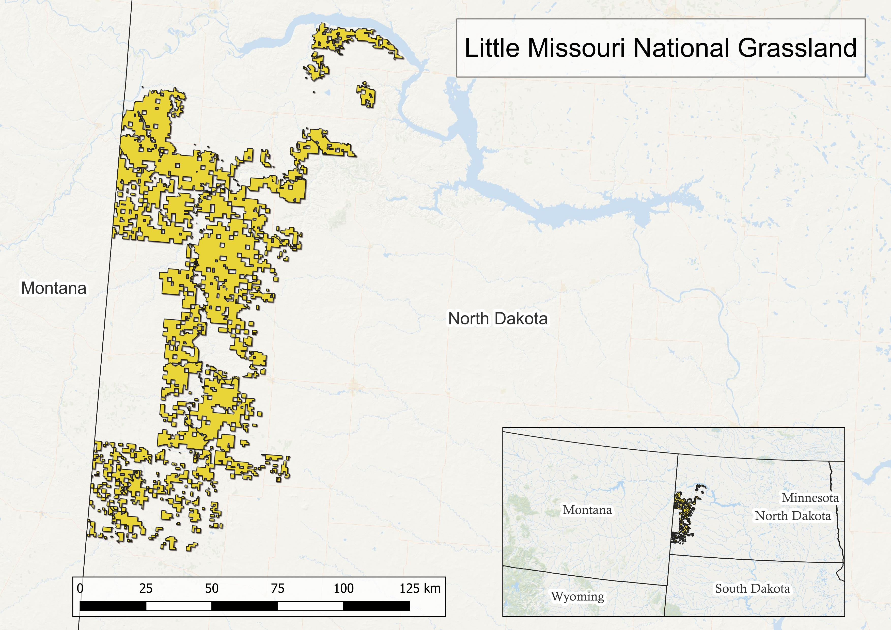
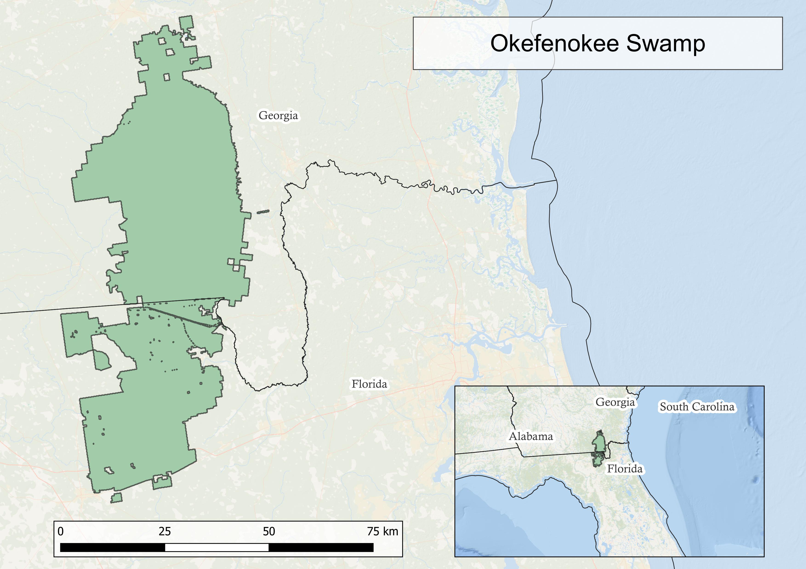

## Goals of this website:
Comparing historical to current fire regimes provides context, and for some situations a guide for the future.  In the United States this task can be done using [LANDFIRE](https://landfire.gov/) products.  Here we show you how for two landscapes, the Little Missouri National Grassland and the Okefenokee swamp.  More specifically we will:

1. Introduce our landscapes
2. Get estimates for annual acres burned just prior to European colonization and visualize them ("Historic Fire" tab)
3. Calculate and visualize mean annual acres burned for years 1985-2020 ("Current Fire" tab)
4. Explore impacts from altered fire regimes.

*The disclaimer:*

We developed this as an extension of our presentation at the [International Association for Landscape Ecology-North America Conference, 2022](https://www.ialena.org/annual-meeting.html).  We are not trained coders and don't even play them on TV, and this is not an indepth comparison.  That said we hope to inspire others to compare fire regimes using LANDFIRE data, and to convert static conference presentations into broader learning opportunities. 

First a little background about our landscapes.

## Little Missouri Grassland
Lorem ipsum dolor sit amet, consectetur adipiscing elit. Nam vitae semper sem. Vivamus molestie tempus felis non porttitor. Vestibulum molestie mauris eget sem pellentesque cursus. Fusce eget eros sit amet ipsum aliquam pharetra. Ut at sem mi. Donec dignissim libero suscipit, viverra diam eu, elementum nisl.

```{r lmngr map, echo=FALSE, message=FALSE, warning=FALSE}

```

## Okefenokee Swamp
Sed tellus sem, condimentum sed blandit non, consectetur vel felis. Pellentesque sit amet lacus ac diam dignissim auctor quis quis ipsum. Curabitur dapibus finibus urna, efficitur mattis urna posuere ac. Pellentesque et lacus non massa lacinia imperdiet. Nunc nisi nisl, tempor vitae lectus feugiat, tincidunt facilisis urna. Nullam a tincidunt odio, eget dapibus felis.


```{r ok map, echo=FALSE, message=FALSE, warning=FALSE}

```


